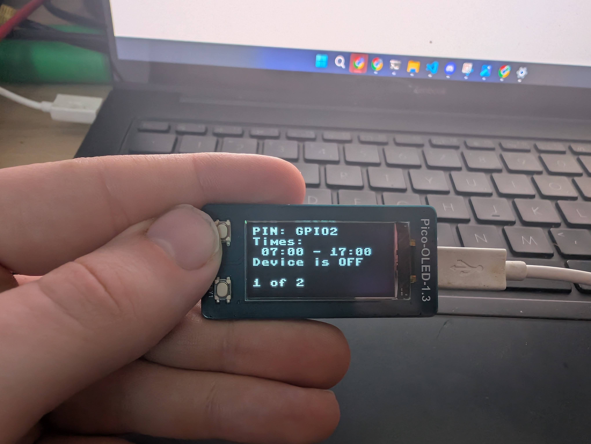
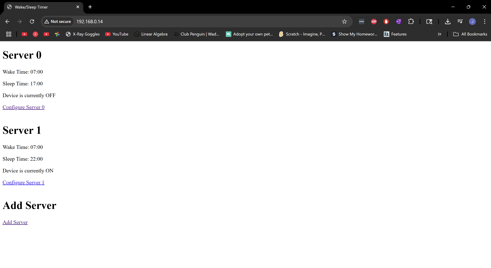

# Time-Based Remote Server Shutdown Controller

## 📘 Project Overview

Recently I switched out my Raspberry pi home server for some old PCs. During setup and testing, they are running in my bedroom, so each night I had to turn them of and restart them the following morning. However this lead to a problem, as A student often running late I would forget to turn them on before I left then wouldn't be able to access files on them all day while on campus. So I decided to build a small microcontroller based system that would allow me to set a time for the server to turn on and off automatically.

## 🚀 My Solution

To solve this, I’ve built a **Raspberry Pi Pico W based system** running MicroPython that:
- Connects to WiFi Network
- Syncs time with an NTP server
- Hosts a small web server where you can add servers
- Each server has a wake/sleep time
- Periodically checks the current time
- Sends an HTTP POST request to a specific endpoint to **shut down the old PCs remotely** when it’s past the defined sleep time
- Pulses a GPIO pin to "press" the power button on the PCs
- Display to show simple information
- Buttons to change what the display shows

## 🧠 How It Works

- **WiFi Setup**: The board connects to the local network using credentials defined in the code.
- **Time Syncing**: NTP is used to get the current time.
- **Web Interface**: A web server lets you add servers and set their wake/sleep times.
- **Scheduler Logic**: At a changeable set interval, the microcontroller checks the current time and compares it to user-defined ranges.
- **Shutdown Trigger**: When the current time is past the defined *sleep time*, it sends a shutdown request via HTTP to the server, waits, and then pulses a GPIO pin to simulate pressing the power button on the PC.
- **Display**: A small OLED display shows the IP address of the board and the current time. You can cycle through different servers using buttons to see their status and wake/sleep times.
- **Power Button Simulation**: GPIO pins is pulsed to simulate pressing the power button on the PC.

## 🔧 Requirements

- Microcontroller with WiFi (ESP8266, ESP32, Raspberry Pi Pico W)
- MicroPython firmware
- A server that exposes a shutdown endpoint (e.g., `/shutdown` route with bearer token)

## 🌐 Server Shutdown Endpoint

This project assumes your server listens for a POST request like so:

```
POST http://myserver.com/shutdown
Headers:
  Authorization: Bearer YOUR_AUTH_TOKEN
```

You’ll need to set this up on the server-side to actually shut the machine down (e.g., via a small Flask app, shell script, etc.).

## 💡 Future Plans

The original idea for this project was to write this in C but I started with MicroPython to test out the concept. However as I started to work on the C version, I very quickly got stuck and ran out of time.

It would also be good to add persistent storage to save the server list and their wake/sleep times, so they are not lost when the board is powered off. This could be done using a small EEPROM or flash memory.

Also adding a system settings page to change settings like display sleep and the time interval for checking the server status would be useful.

## 📦 Hardware Requirement
- Raspberry Pi Pico W
- 1.3" OLED Display
- Opto-coupler to simulate the power button press

I chose to use an opto-coupler rather than connect the two circuits while still allowing the GPIO pin to control the power button.

## 📁 File Structure

```
project_main.py           # MicroPython script to run on the board

project_simple_main.py    # Simplified version of the main script, designed to base the C version off
```

## 🛠️ Configuration

Modify the following variables in the script:

```python
SSID = 'your_wifi_ssid'
PASSWORD = 'your_wifi_password'

```

Replace the URL and token in `shut_server_down()` with your actual shutdown endpoint:

```python
url = "http://myserver.com/shutdown"
headers = {
    "Authorization": "Bearer YOUR_AUTH_TOKEN",
    "Content-Type": "application/json"
}
```

## 💻 Code Breakdown

- **OLED_1inch3 Class**: Handles the OLED display. This is directly from the [Waveshare Example Code](https://www.waveshare.com/wiki/Pico-OLED-1.3).
- **Server Class**: Represents a server with its wake/sleep times and methods to check if it should be shut down and methods associated with the server.
- **WebServer Class**: Responsible for running the webserver and handling incoming requests.
- **Server_Manager**: Manages the list of servers and their states.
- **OLED_Manager**: Responsible display pages, transitioning between them, and updating the display with the current time and server information.
- **Button_Handler**: Handles button presses to cycle through the display pages.
- **sync_time function**: Syncs the time with an NTP server.
- **webserver thread**: Runs the web server in a separate thread.
- **main loop**: Periodically gets the current time and calls all the update methods for the servers, server manager, OLED manager, and button handler.


## 📸 Screenshots
### OLED Display
Here is a picture of the OLED display showing the "home page" which shows the current time, IP address of the board, the number of servers added and the number of on servers.


Here is a picture of the OLED display showing the "server page" which shows the server name, wake/sleep times and the current status of the server.


Here is a video showing the OLED display in action, cycling through the different pages.


### Web Interface
Here is a screenshot of the web interface showing the home page with the list of servers and their status.


Here is a screenshot of the web interface showing the add server page.


Here is a screenshot of the web interface showing the server page with the server name, current status and the options to update the wake/sleep times.

